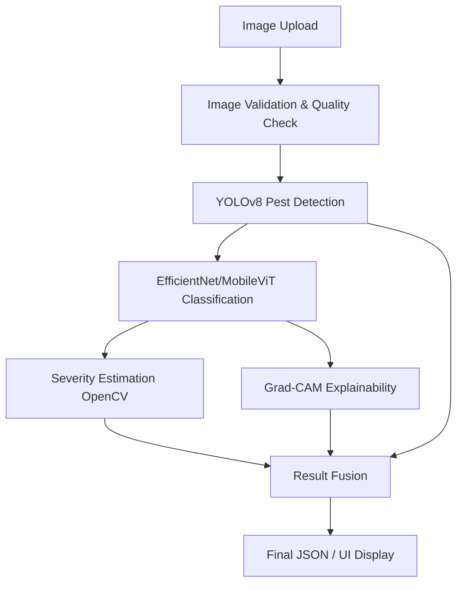

# AgriGuard: AI-Based Early Crop Disease, Pest & Severity Detection System

AgriGuard is a comprehensive, research-grade agricultural computer vision platform designed for early disease and pest detection, particularly focused on rice/paddy crops.

## 🚀 Features
- **Crop & Disease Classification:** EfficientNetB0 and MobileViT-S based classification.
- **Pest Detection:** YOLOv8 bounding box object detection.
- **Severity Estimation:** OpenCV-based lesion-to-leaf area percentage calculation.
- **Explainable AI (XAI):** Grad-CAM heatmaps showing which areas of the leaf influenced the model's decision.
- **FastAPI Backend:** Production-ready RESTful API.
- **React + Tailwind Frontend:** Modern, interactive dashboard for easy usage.
- **Cross-Dataset Generalization:** Built-in evaluation scripts to test models on external, unseen data.

## 📁 Architecture


## 🛠️ Technology Stack
- **Deep Learning:** PyTorch, torchvision, timm, Ultralytics (YOLO)
- **Computer Vision:** OpenCV, numpy
- **Backend:** Python, FastAPI, Uvicorn, Pydantic
- **Frontend:** React, Vite, TailwindCSS
- **Orchestration:** Docker, Docker Compose

## 📦 Dataset Sources & Preparation
AgriGuard uses multiple sources (PlantVillage, Paddy Doctor, IP102, etc.).

1. Copy `.env.example` to `.env` and fill in Kaggle/Roboflow keys.
2. Run data preparation:
   ```bash
   python -m agriguard prepare-data
   ```
   *Note: Without API keys, the system runs in Demo Mode and expects manual dataset drops.*

## 🚀 Installation & Usage
### Docker (Recommended)
```bash
docker-compose up --build
```
- **Backend:** http://localhost:8000/docs
- **Frontend:** http://localhost:5173

### Manual Setup
**Backend:**
```bash
cd backend
pip install -r requirements.txt
uvicorn app.main:app --reload --port 8000
```
**Frontend:**
```bash
cd frontend
npm install
npm run dev
```

## 📊 Training Models
Train models using the built-in CLI:
```bash
python -m agriguard train --model efficientnet
python -m agriguard train --model mobilevit
python -m agriguard train --model yolo
```
Alternatively, upload `notebooks/AgriGuard_Training.ipynb` to Google Colab for GPU training.

## 🔬 Model Comparison & Severity Methodology
- **Classification Benchmark:** Compares `Accuracy`, `Precision`, `Recall`, `F1`, and `Inference Time`.
- **Cross-Dataset Evaluation:** Trains on *Paddy Doctor* and validates against *External Rice Leaf* to calculate performance drop.
- **Severity:** Calculates pixel ratio `(Lesion Area / Total Leaf Area) * 100`. Configurable thresholds (Low 0-10, Medium 10-30, High >30).

## 📄 License
MIT License
